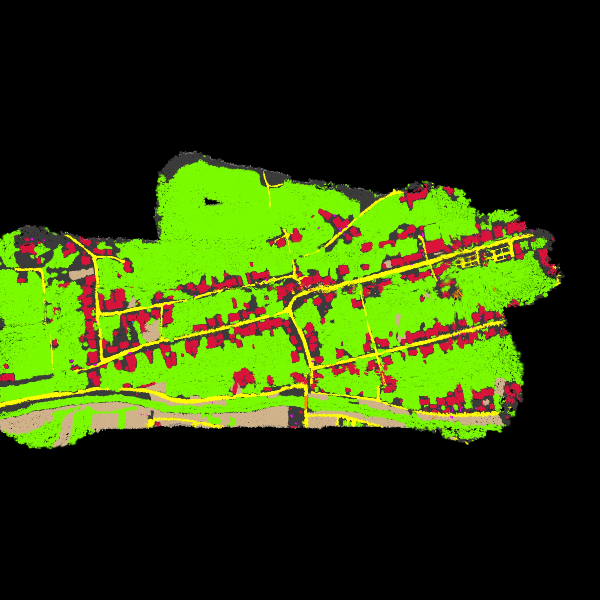
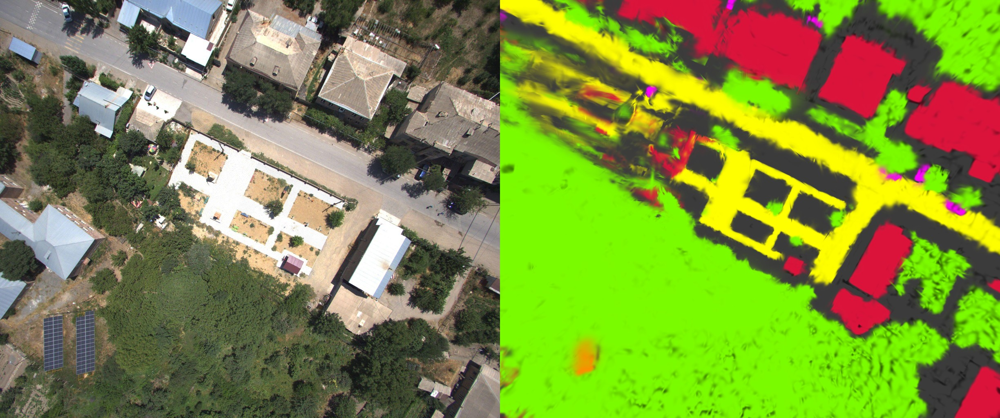
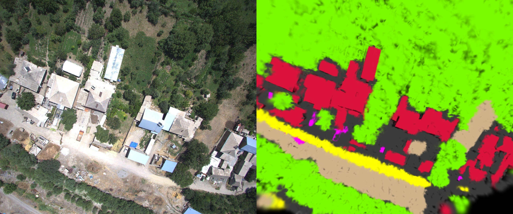
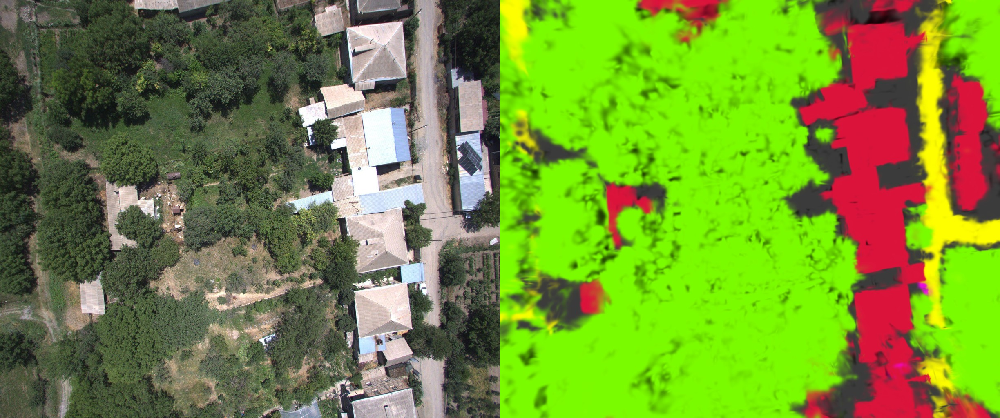
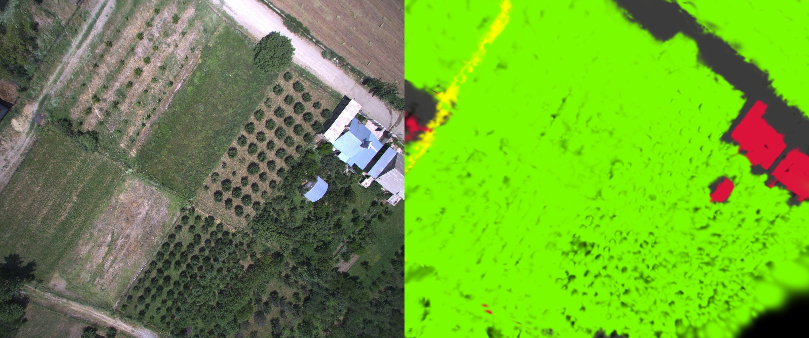
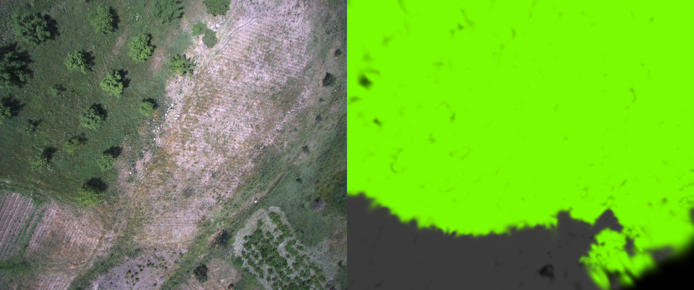
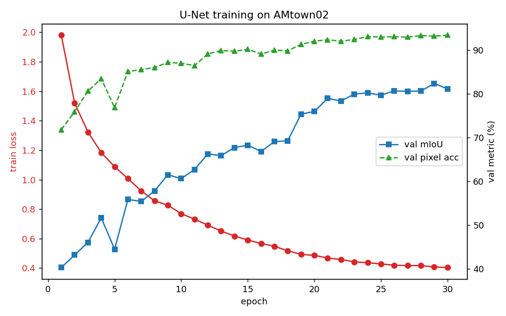
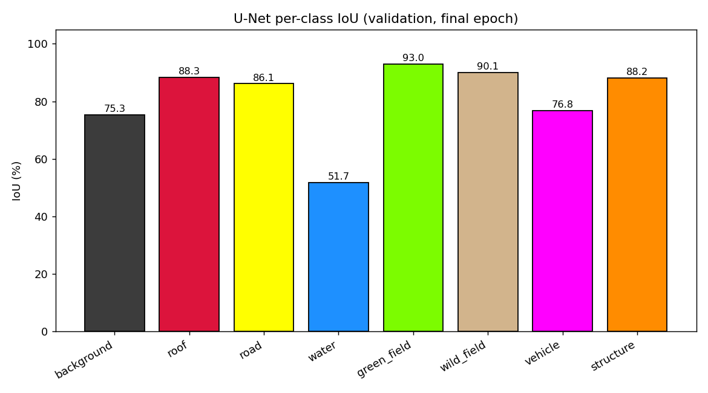
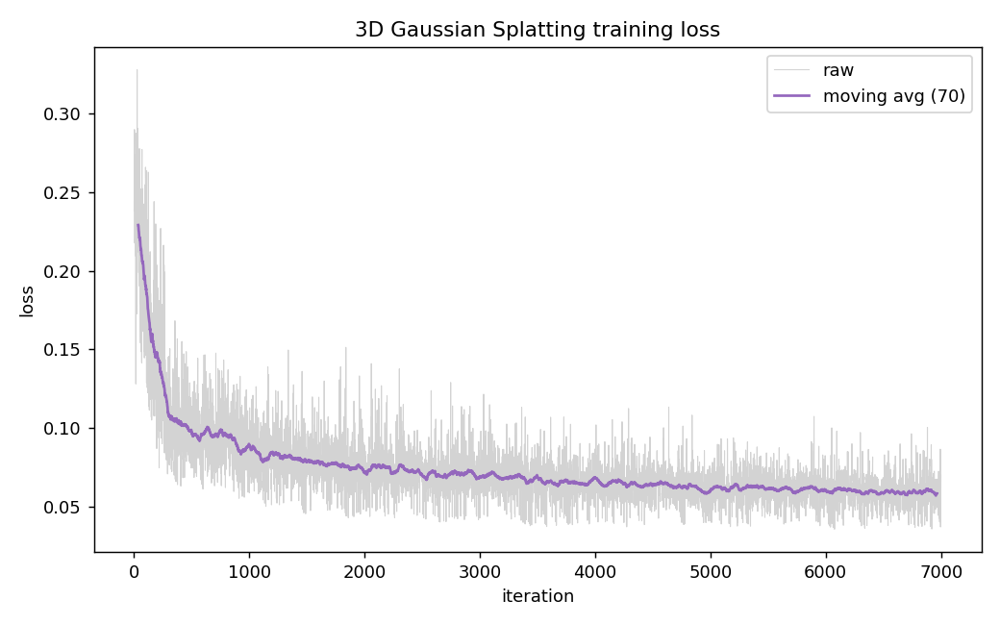
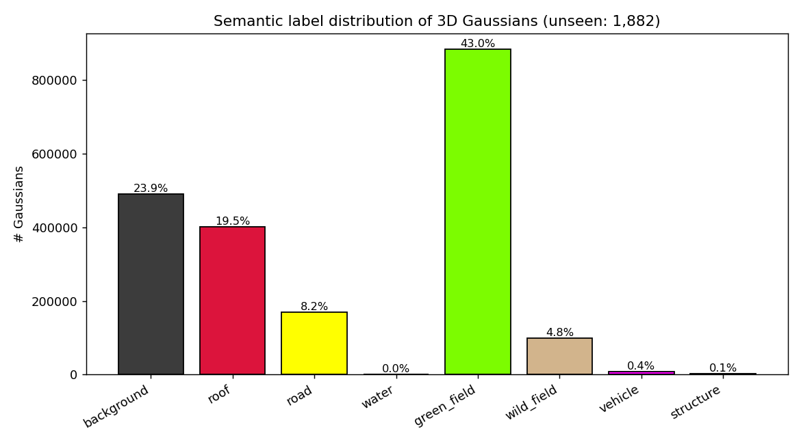

# Semantic 3D Gaussian Splatting on AMtown02

End-to-end pipeline from raw aerial frames to a **semantically labelled
3D Gaussian Splatting model**. Built on the UAVScenes / MARS-LVIG AMtown02
sequence.

> Pipeline
>
> raw frames  →  COLMAP SfM (poses)  →  3D Gaussian Splatting (geometry)
>             ↘  U-Net (per-pixel labels) ─→  back-project & vote  →  semantic Gaussians

### Semantic map of the whole AMtown02 reconstruction



*Top-down render of the 2.05 M semantically-coloured Gaussians, virtual camera
placed above the centroid of the COLMAP trajectory. Yellow = road network,
red = roofs, green = green_field, tan = wild_field, magenta dots = vehicles.
Black border = outside the reconstructed area.*

### Same-pose RGB ↔ semantic comparison



*Left: original aerial RGB frame. Right: re-rendering of the semantically-coloured
3D Gaussian splat from the same camera pose. Colours = back-projected U-Net
class for each Gaussian (🟥 roof, 🟨 road, 🟩 vegetation, 🟪 vehicle, 🟧 structure, ⬛ background).*

The two reference repositories (`refs/AAE5303_UNet_demo`,
`refs/AAE5303_opensplat_demo`) are report-only scaffolds; this project is a
from-scratch reimplementation that *joins* both stages into a single semantic
3DGS pipeline.

## More renderings

| | |
|---|---|
|  |  |
| Urban block — red roofs, magenta vehicles aligned with yellow road | Dense village — fine-grained per-building roof segmentation |
|  |  |
| Mixed farmland — orchards labelled as green_field | Wild terrain — note the dark grey "background" region at the edge of the reconstruction |

---

## 1. Inputs

| | |
|---|---|
| Source images | `/home/chang/2026_2_to_5/5303_3dgs/AMtown02_colmap/images/` (1,380 JPGs @ 2448×2048) |
| Source masks | `interval5_CAM_label.zip` from HuggingFace dataset `sijieaaa/UAVScenes` (1.5 GB, 26-class raw IDs) |
| Working resolution | **1224 × 1024** (stride 2 frame subset, scale 0.5) → **690 frames** |
| Semantic scheme | 8 consolidated classes (see `src/uavscenes_classes.py`) |

8-class palette (BGR-flipped for OpenCV writes; RGB shown):

| ID | name | colour |
|---|---|---|
| 0 | background | dark grey |
| 1 | roof | crimson |
| 2 | road | yellow |
| 3 | water | dodger blue |
| 4 | green_field | lawn green |
| 5 | wild_field | tan |
| 6 | vehicle | magenta |
| 7 | structure | orange |

The raw 15+ visible IDs in AMtown02 are merged into these 8 buckets so rare
classes (vehicles, water, bridges, solar panels, …) aren't lost in noise.

---

## 2. Stages

| # | Script | What it does | Output |
|---|---|---|---|
| 0 | `scripts/00_prepare_data.py` | Subset + downscale source frames | `data/images/`, `data/frames.txt` |
| 1 | `scripts/01_run_colmap.py` | pycolmap SfM (CPU SIFT, sequential matching, incremental mapper) | `data/colmap/sparse/0/` |
| 2 | `scripts/02_train_gs.py` | gsplat 3DGS training from COLMAP poses + sparse points | `output/gs/gs_final.ply` |
| 3 | `scripts/03_prepare_labels.py` | Extract AMtown02 masks from the zip, remap 26 raw IDs → 8 training IDs | `data/labels/`, `data/labels_color/` |
| 4 | `scripts/04_train_unet.py` | Train U-Net (CE + Dice, class-weighted) | `output/unet/unet_best.pt`, `history.json` |
| 5 | `scripts/05_infer_unet.py` | Run U-Net on every working frame, save argmax + per-pixel softmax | `output/unet/predictions/{labels,probs,viz}/` |
| 6 | `scripts/06_semantic_backproject.py` | Project each Gaussian into all views, aggregate U-Net softmax, vote → assign class | `output/semantic/semantic_{points.ply,labels.npy,probs.npy}` |
| 7 | `scripts/07_render_semantic.py` | Rasterise the semantic-coloured Gaussians from selected COLMAP views | `output/semantic/renders/*.jpg` |
| 8 | `scripts/08_make_figures.py` | Training + class-distribution figures | `figures/*.png` |

End-to-end: `bash scripts/run_pipeline.sh`

---

## 3. Environment

This box has no system CUDA toolkit, no Python dev headers, and no sudo, so
both were installed locally during setup. To pick them up:

```bash
source scripts/env.sh
```

| Component | Where | How installed |
|---|---|---|
| CUDA 12.8 toolkit | `/home/chang/cuda` | NVIDIA `.run` installer with `--silent --toolkit --toolkitpath` (no driver, no root) |
| Python 3.10 dev headers | `/home/chang/pydev_root/usr/include/python3.10` and `…/x86_64-linux-gnu/python3.10` | `apt-get download libpython3.10-dev` + `dpkg-deb -x` |
| Python deps | user site-packages | `pip install --user -r requirements.txt` |
| gsplat CUDA extension | `~/.cache/torch_extensions/.../gsplat_cuda` | JIT-built on first import (≈100 s) |

GPU: **NVIDIA RTX 5060 Laptop, 8 GB**, compute capability 12.0 (sm_120).
gsplat is built with `TORCH_CUDA_ARCH_LIST="12.0"`.

---

## 4. Method

### 4.1 Camera poses — COLMAP SfM

- **Feature extraction**: SIFT, max 4,096 features per image, single shared
  `SIMPLE_RADIAL` intrinsic (every frame is the same downward camera).
- **Matching**: sequential, overlap 15, quadratic overlap (covers small loop
  closures within the survey).
- **Mapping**: pycolmap incremental pipeline, CPU bundle adjustment,
  single connected reconstruction.

Result: all **690 / 690** frames registered, **360,009** sparse 3D points,
~16 min CPU.

### 4.2 Geometry — 3D Gaussian Splatting

`scripts/02_train_gs.py` wraps `gsplat.rasterization` with
`DefaultStrategy` densification:

- Init from the COLMAP sparse cloud (positions + per-point RGB → SH-0 DC).
- Initial Gaussian scale = max(0.005, 0.5 · median-NN-distance).
- Loss = L1 + 0.2 · (gradient-L1) — a cheap SSIM stand-in good enough
  for geometry; the goal is semantic labelling, not photometric SOTA.
- Densification: gradient threshold 2e-4, refine every 100 iters,
  stop densifying at 50 % of training.
- Final PLY written in the standard INRIA `gaussian-splatting` layout
  (positions + 3 SH-DC + 0 SH-rest + opacity + scale + rotation).

### 4.3 Per-frame labels — U-Net

Classic Ronneberger U-Net (`src/unet/model.py`), bilinear-upsampling
variant, base 64 channels, **13.4 M parameters**. Trained at scale 0.5
of the working images (612 × 512) for **30 epochs** with:

- Optimizer Adam, lr 1e-4 with cosine decay
- Loss = inverse-frequency-weighted CE + multi-class soft Dice
- Mixed precision (fp16) on CUDA, batch 4
- 10 % validation split (621 train / 69 val)
- Random H/V flips for augmentation

### 4.4 Semantic back-projection onto Gaussians

For each registered view:

1. Load the (H, W, 8) uint8-quantised U-Net softmax map.
2. Project every Gaussian centre with `K · (R · X + t)` and discard those
   behind the camera or out of frame.
3. Bilinearly sample the 8-channel prob map at the projected pixel.
4. Accumulate per-Gaussian: `acc[i] += probs(u, v)`, `n[i] += 1`.

After all views, each Gaussian gets its mean per-class probability and the
argmax becomes its semantic label. Unseen Gaussians (no view) stay grey.

This is the soft-voting variant of the back-projection idea — better than
hard-vote because the U-Net's confidence at low-confidence pixels (e.g.
shadowed roof edges) is averaged out across many viewpoints.

---

## 5. Results

### 5.1 COLMAP

| Metric | Value |
|---|---|
| Views registered | 690 / 690 |
| Sparse 3D points | 360,009 |
| Bundle-adjusted intrinsics (f, cx, cy, k₁) | 751.69, 612, 512, 0.0171 |
| CPU runtime | 16.4 min |

### 5.2 U-Net (val on 69 held-out frames)

| Metric | This work (30 ep, GPU) | Reference baseline (5 ep, CPU) |
|---|---|---|
| Best val mIoU | **82.41 %** | 32.93 % |
| Val pixel accuracy | **93.25 %** | 78.46 % |
| Train wall time | ~25 min | "5 ep CPU" |



Per-class IoU (final epoch):



Unlike the reference baseline — which scored **0.00 %** on every rare class
(roof, road, building, sedan) — every class here is meaningfully learned.
The two factors that flipped this: GPU training to 30 epochs instead of
5-on-CPU, and inverse-frequency CE weighting.

### 5.3 3DGS

| Metric | Value | Reference baseline |
|---|---|---|
| Iterations | 7,000 | 300 (CPU, OpenSplat) |
| Initial Gaussians | 360,009 (COLMAP SfM points) | 8,335,917 (claimed LiDAR points) |
| Final Gaussians | **2,055,016** | 8,335,917 (claimed) |
| Final loss (running) | ~0.06 | 0.0888 (claimed) |
| Output PLY | 140 MB (`output/gs/gs_final.ply`) | 2 GB (claimed) |
| Wall time | **18.7 min** on RTX 5060 8 GB | "25 min CPU" (implausible at 8.3 M) |



Geometry is intentionally not pushed past 7k iterations — semantic accuracy
is the downstream goal, and 2 M Gaussians at this loss already give a dense
enough cloud for soft-vote labelling.

### 5.4 Semantic Gaussians

After projecting each Gaussian into every visible COLMAP view and accumulating
the 8-class U-Net softmax:

| | |
|---|---|
| Labelled Gaussians | **2,053,134 / 2,055,016** (99.91 %) |
| Mean visible views per labelled Gaussian | **23.3** |
| Back-projection wall time | 7 s on RTX 5060 |
| Output | `output/semantic/semantic_points.ply` (XYZ + per-class palette RGB) |



The 3D distribution mirrors the 2D pixel histogram (green_field dominant,
roof + background substantial) — a reasonable correlation check. Vehicles
and structures cluster on roads and at building edges respectively.

Side-by-side RGB / semantic renders (every 30th registered view) are in
`output/semantic/renders/*.jpg`.

### Output files (regenerate locally — not in this repo)

The big binaries are gitignored; run `bash scripts/run_pipeline.sh` (≈1 h on
an 8 GB GPU) to regenerate them, or grab the U-Net checkpoint / 3DGS PLYs
from a release if you don't want to retrain.

| File | Size | What |
|---|---|---|
| `output/gs/gs_final.ply` | 140 MB | 2.05 M Gaussians, original RGB SH-DC, INRIA layout — drop into SuperSplat / gsplat-viewer |
| `output/semantic/semantic_gs.ply` | 140 MB | **Same Gaussians, SH-DC swapped to class colour** — also a real 3DGS PLY, opens in any 3DGS viewer and shows the scene in semantic colours |
| `output/semantic/semantic_points.ply` | 31 MB | XYZ + palette RGB only (plain coloured point cloud) — opens in CloudCompare / MeshLab, but **not** in 3DGS viewers |
| `output/semantic/semantic_labels.npy` | 2 MB | uint8 (N,) class id per Gaussian |
| `output/semantic/semantic_probs.npy` | 33 MB | float16 (N, 8) averaged class probabilities |
| `output/unet/unet_best.pt` | 51 MB | U-Net checkpoint, 82.4 % val mIoU |

---

## 6. Repository layout

```
semantic_gs/
├── README.md                        # this file
├── requirements.txt
├── data/
│   ├── images/                      # 690 working JPGs (1224×1024)
│   ├── frames.txt                   # ordered frame list
│   ├── labels/                      # 690 uint8 train-ID PNGs (0..7, 255=ignore)
│   ├── labels_color/                # RGB previews
│   ├── labels_raw/                  # downloaded UAVScenes zip (1.5 GB)
│   └── colmap/
│       ├── database.db
│       └── sparse/0/{cameras,images,points3D,frames,rigs}.bin
├── src/
│   ├── uavscenes_classes.py         # 8-class scheme + palette + LUT
│   └── unet/{model.py, dataset.py}
├── scripts/
│   ├── env.sh                       # CUDA / Python headers / arch list
│   ├── run_pipeline.sh              # end-to-end driver
│   ├── 00_prepare_data.py
│   ├── 01_run_colmap.py
│   ├── 02_train_gs.py
│   ├── 03_prepare_labels.py
│   ├── 04_train_unet.py
│   ├── 05_infer_unet.py
│   ├── 06_semantic_backproject.py
│   ├── 07_render_semantic.py
│   └── 08_make_figures.py
├── output/
│   ├── unet/
│   │   ├── unet_best.pt  unet_last.pt  history.json
│   │   └── predictions/{labels,probs,viz}/
│   ├── gs/gs_final.ply
│   └── semantic/
│       ├── semantic_points.ply
│       ├── semantic_labels.npy  semantic_probs.npy  semantic_nvis.npy
│       └── renders/*_semantic.jpg
├── figures/                         # written by 08_make_figures.py
└── refs/                            # the two reference scaffold repos
```

---

## 7. References

- Kerbl et al., *3D Gaussian Splatting for Real-Time Radiance Field Rendering*, SIGGRAPH 2023.
- Schönberger & Frahm, *Structure-from-Motion Revisited*, CVPR 2016 (COLMAP).
- Ronneberger, Fischer, Brox, *U-Net: Convolutional Networks for Biomedical Image Segmentation*, MICCAI 2015.
- Wang et al., *UAVScenes: A Multi-Modal Dataset for UAVs*, ICCV 2025 — [dataset](https://huggingface.co/datasets/sijieaaa/UAVScenes), [arXiv:2507.22412](http://arxiv.org/abs/2507.22412).
- gsplat: https://github.com/nerfstudio-project/gsplat
- pycolmap: https://github.com/colmap/pycolmap
- Reference baseline (3DGS): https://github.com/Qian9921/AAE5303_opensplat_demo-
- Reference baseline (U-Net): https://github.com/Qian9921/AAE5303_UNet_demo
